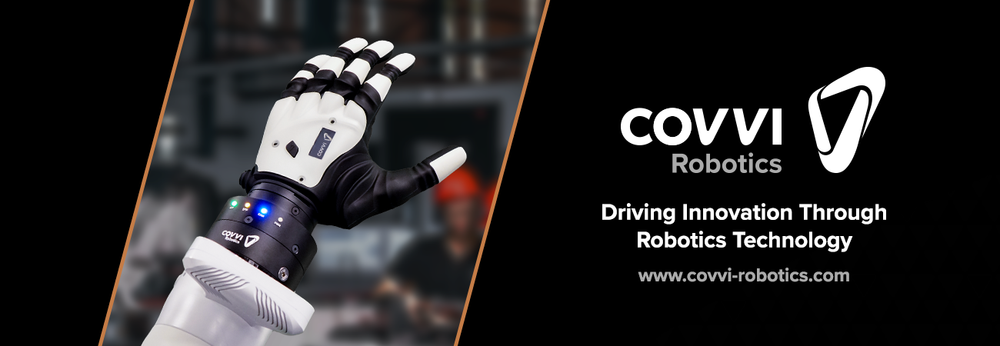

**Strong, robust, and feature-rich; the team behind COVVI has developed a highly functional robotic hand that establishes a new level of quality and performance through its cutting-edge design. The COVVI Robotic Hand is a state-of-the-art multi-articulated hand with the ability to complete complex manipulation tasks, to the robotics sector. Our clients are at the heart of everything we do and we’re passionate about delivering a first-class customer experience.**

